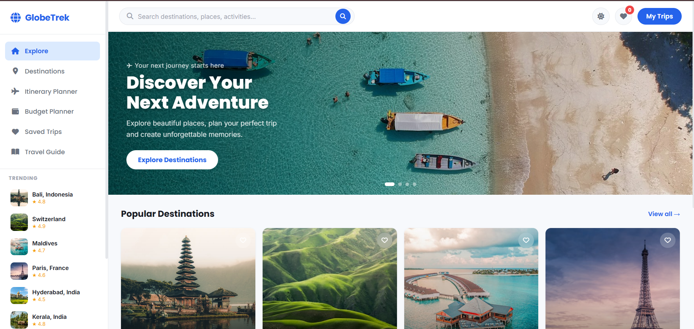
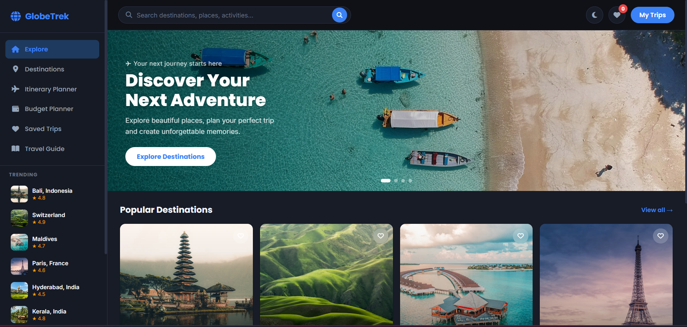

# 🌍 GlobeTrek — Travel Explorer

>🌐 **Live App** 👉 [Click Here](https://globetrek-travel-explorer.netlify.app/)

## **Explore smarter, plan better, travel easier**

GlobeTrek is a modern, fully responsive travel explorer web application that helps users discover beautiful destinations around the world, plan day-wise itineraries, estimate trip budgets, and explore real destination photos — all in one clean, intuitive interface.

Built as a portfolio project to demonstrate real-world frontend development skills including API integration, dynamic search, local storage persistence, and a polished UI with light/dark mode support.

---

## 📸 Screenshots

| 🌞 Light Mode | 🌙 Dark Mode |
|--------------|-------------|
|  |  |

---

## ✨ Features

- 🏠 **Explore Page** — Hero slideshow, popular destination cards, quick itinerary planner and budget estimator widgets
- 🗺️ **Destinations** — Browse 19 international and Indian destinations with filters by region, category and sort order
- 🔍 **Smart Search** — Search any destination in the world — fetches real photos from Unsplash API dynamically
- 📋 **Itinerary Planner** — Generate a personalized day-wise travel plan for any destination
- 💰 **Budget Planner** — Smart budget calculator with per-destination rates, currency conversion and visual progress bars
- ❤️ **Saved Trips** — Save favourite destinations and itineraries with localStorage persistence
- 🗺️ **Interactive Maps** — Embedded Google Maps for every destination
- 🖼️ **Photo Gallery** — Real destination photos fetched from Unsplash API
- 📖 **Travel Guide** — Filterable articles on Tips, Guides, Packing, Safety and Culture
- 🌙 **Dark / Light Mode** — Full theme support with smooth transitions
- 📱 **Fully Responsive** — Works beautifully on mobile, tablet and desktop
- ✨ **Smooth Animations** — Skeleton loaders, staggered card reveals and page transitions

---

## 🛠️ Tech Stack

| Technology | Purpose |
|-----------|---------|
| HTML5 | Semantic page structure |
| CSS3 | Styling, CSS Variables, Flexbox, Grid, Animations |
| JavaScript ES6+ | App logic, DOM manipulation, async/await |
| Unsplash API | Real destination photo gallery and dynamic search |
| Google Maps Embed | Interactive maps for every destination |
| localStorage | Saving trips and itineraries across sessions |
| Font Awesome 6 | Icons throughout the app |
| Google Fonts | Poppins (headings) + Inter (body text) |

---

## 📁 Project Structure

```
globetrek/
├── css/
│   ├── style.css        → Core styles, theme variables, sidebar, cards, modal
│   └── style2.css       → Animations, skeleton loaders, autocomplete dropdown
├── js/
│   ├── app.js           → All application logic, API calls, event handling
│   └── data.js          → Destination data, itinerary templates, budget rates
├── image.png            → App favicon
├── index.html           → Main HTML — all 6 pages in one file (SPA pattern)
```

---

## 🗺️ Destinations Included

**Indian Destinations:**
Hyderabad · Kerala · Goa · Manali · Rajasthan · Agra

**International Destinations:**
Bali · Paris · Tokyo · Maldives · Switzerland · Santorini · New York · Dubai · London · Singapore · Bangkok · Rome · Amsterdam

---

## ⚙️ Setup & Run Locally

```bash
# Clone the repository
git clone https://github.com/Mounika-Balusa05/globetrek.git
cd globetrek

# Open in browser
# Just open index.html with VS Code Live Server!
```

No build steps, no npm install — pure HTML, CSS and JavaScript! ✅

---

## 👩‍💻 Author

**Mounika Balusa**
Full Stack Developer
📍 Hyderabad, Telangana, India

> Built with ❤️ as a portfolio project for internship and job applications | © 2026
